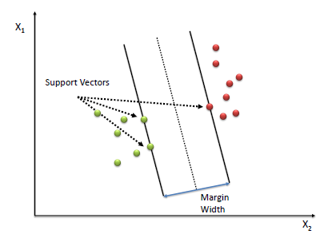
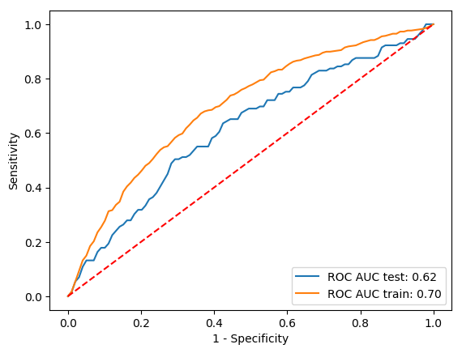

## Welcome to the CS 7641 Project

### Introduction
```diff
- TODO
```


### Background 
Cardiovascular diseases (CVD) are the number one cause of deaths worldwide, with over 17 million deaths per year [1]. Since 1947, the Framingham Heart Study (FHS) has been a central pioneer of the expansion from treatment-based to preventive medicine by establishing risk factor determination as a central pillar of data analysis of studying the disease. [2]. With more data available than ever before, machine learning has been shown to improve risk score predictions for CVD and beyond [3]. 
The dataset consists of continuous (i.e., Age, Cigarettes per day, etc.) and binary (Is this person a current smoker) variables. In total, there are 15 features included by over 4000 records. The aim is to predict if someone is at risk of developing a CVD within the next ten years and to pinpoint potential risk factors. The dataset is publicly available on [kaggle](https://www.kaggle.com/dileep070/heart-disease-prediction-using-logistic-regression).

### History of the Study 

The Framingham Heart Study began in 1948, after President Franklin D. Roosevelt died of the widely mysterious cardiovascular disease. At this time, the medical community did not understand cardiovascular disease at all, and had no idea of any risk factors associated with the seemingly spontaneous death sentence. Even the extremely high blood pressure measurements that were taken from FDR were not seen to be indicative of any problem, because there was no association between high blood pressure and cardiovascular disease at the time. Truman signed the National Heart Act, which in part financially supported the study started by Gilcin Meadors in 1947, who collected the first subject for the study in 1948. Unlike most epidemiologiccal studies at the time, this study included men and women from Frammingham, Massachusetts evenly in the initial cohort. As time went on, the offspring of the initial cohort were also recruited to participate into the study. In 1961, study investigators from the Framingham heart study were the first to popular the terms "risk factor" and "risk score" as a novel analytical method to predict diasese, creating a logistic model with various factors, such as cholesterol, blood pressure, and number of cigarettes smoked. In 1988, they created what still is the best known risk profile for cardiovascular disease, the "Framingham Risk Score", and created the criteria still used today to define "heart failure". As time went on, they continued to better understand not only cardiovascular disease and the effectiveness of various treatment strategies, but also the risk factors associated with strokes. They have recruited the third generation children of the offspring cohort, and also now have added cohorts additional  to bring ethnic diversity to the study, which previously only analyzed white and European citizens of Framingham. 


### Data Description
The data used in this study comes from a subset of the Framingham Heart Study participants. It has 15 features and 4000 subjects. The breakdown of features within this dataset is shown below: 
[ insert figure ] 


## Unsupervised Learning Section
### Data Cleaning
One of the most challenging tasks in data analysis is data cleaning, on which scientists spend an enormous amount of time enhancing the reliability and quality of the data. In working with any real dataset, usually, there are some data points in which some features are missing. This is usually due to not maintaining the data correctly or because this data has not been recorded initially. These missing values incur errors and unreliability in the analysis and eventually leads to not having a robust predictive model. To overcome this problem, we need to find and imput values for the missing ones by using the standard probabilistic models or even refine the data to remove the errors. This helps us to obtain a reliable dataset that improves the quality of the training data for analysis and provides accurate decision-making.

Similar to all experimental set of data, the data used in this project has some missing values for some features. The data used in the current project has 4240 labeled data points with 15 features, of which 6 features have some missing values. There are many ways in which data cleaning can be executed. Most commonly, one could remove the datapoints with any number of missing values. In this case we could lose a significant portion of the data, which could diminish the reliability of the model. More efficiently, one could find the average of values of a feature and imput that for all missing values for the corresponding feature. Or, if the labels are given, like in this project, missing features for each data point can be calculated by finding the average of the features for that associated label. 

In this project, the dataset contains two labels that correspond to whether the person develops heart disease or not. So, we basically had two different ways to go. The first way was to imput the missing values by using the clustering method of the unsupervised data. In this method, the dataset is divided into different clusters according to the features that do not have any missing value. Then, the missing values of each data point are found by averaging the values of the corresponding feature of that cluster. In this method, the best number of clusters is determined by using the Elbow method which is shown in below. The other method was to find the missing values based on the labels. To do so, the *k*-nearest-neighbors within the class were identified, and their average value for each missing feature is calculated. The optimal number for *k* has been determined using the elbow method. The plot below shows that *k=6* is a suitable choice as well as that the KNNImputer implemented in scikit-learn and our own implementation yield similar results. In this project, although the differences between the calculated values are not very vast, imputing based on the labels was used.


   
   


### Dimensionality Reduction through Principle Component Analysis 

To make the data easier to work with, principle component analysis was done to reduce the number of dimensions of the dataset. After feature engineering, the dataset was very large, as combinations of variables were made. The PCA Scikit-Learn API was used, with the optimize functionality turned on within that function to choose what combination of features will be best. 

## Supervised Learning Section

### Logistic Regression
```diff
- FSs
```

### Support Vector Machine Classifier

The support vector classifier is a classifier that aims to minimize the following function:


The classifier attempts to minimize the number of points misclassified by the classifier while also maximizing the “margin” or distance between the classes. The margin is defined by the points touching the “support” vectors on the edges of the margin. The general idea is that the support vectors should have a stronger impact on the placement of the class divider since they are closer to the margin, and that the margin should be as large as possible to ensure that the model is as generalizable as possible. 





### Random Forest
```diff
- FS
```


### Neural Network

Neural networks are a computuational analog to the biological neural networks found in human brains, designed to form probability-related associations between inputs to solve problems of regression or classification. The network is initialized as a set of random associations or "weights" between layered neurons and the resulting output is computed during the forward propogation step. During the backward propogration step, the weights are optimized to minimize the loss function using optimization techniques like stochastic gradient descent or the ADAM optimizer. The model's hyperparameters, like the number of hidden neurons, which activation function was used and regularization strength, can be optimized on a validation set. 

   

In order to classify the 10 year risk of coronary heart disease CHD, a feed forward, two hidden layer network was created, as shown above. The size of the input layer is the number of features, in our case being 15 features we have 15 input neurons. Next, we choose the number of hidden layers to be two. Selecting two hidden layers for the network is best because if we choose more layers, we are more likely to run into overfitting issues due to the model being too complex to learn the underlying sturcture, similar to using a polynomial of degree 6 to learn a quadratic function. In addition, the vanishing gradient problem can occur in networks too deep due to multiplication of the paritial derivatives for each layer [5]. Selecting less than two hidden layers could result in the model not being able to learn non-linearly seprable data, as in the classic example of a single perceptron network not being able to learn the XOR function because there is no linear path between (0,0) and (1,1), as shown below [6]:


The activation function of choice for the hidden layers was the Relu function due to other classical functions like Sigmoid and Tanh tend to saturate the information, since they are mostly sensitive to changes around their midpoints [7]. For the backpropogation step, the stochastic gradient descent alogrithim was used with a learning rate of 0.0001. This learning rate was chosen by running the model with multiple rates and seeing which one provided fast convergence over the 150 epochs used to train. The dataset was split into 66% training and 33% test. In order to quantify perfomance, a binary cross entropy loss function was for training and testing. The following plots show the training loss vs epochs as well as accuracy vs epochs. 


The final accuracy of the model was 0.85 on the test set, making it the second best performing classifier. 


## Results

### Finding the best estimator
We evaluate the performance of logistic regression (LR), support vector machine (SVC), random forest (RF) and a neural network (NN) with respect to prediction of risk of developing a heart disease within ten years. 
The performances have been assed in terms of accuracy (ACC) and area under (AUC) the receiver operating characteristic (ROC) curve. These to metrics did not positively correlate with each other since the present dataset is highly skewed. The number of patients without risk of developing a heart disease is dramatically outweighing those who are in risk. Hence, the classifier would perform very well when always predicting *No risk* when using accuracy as a measure. However, this would cause a drop in true positive rate or sensitivity and thereby lead to a low AUC. Thus, the same classifier would perform badly in terms AUC.

In order to decide which of the above mentioned classifier works the best on our dataset, we performed a grid search over the following parameter space:
 - k the number of nearest neighbors within a class to consider when imputing the missing values
- d: the degree used for creating polynomial features
- n : the number of components to keep during the PCA
- method: the estimator (one of LR, SVC, RF, NN)

When assessing the performs with respect to the accuracy a random forest classifier outperforms the other classifier with an accuracy of *0.86* but the AUC is only *0.62*. *k* has been found to be 2, *d* to be 3 and *n* to be 4. However, as shown below the scenario of high accuracy and low AUC described above occurs with these settings. The model just always predicts *No risk* which is pretty good guess just by chance but it misses nearly all patients who are at risk. In a medical setting this is particularly bad thus, AUC is the more appropriate metric to assess the classifiers performance.


When doing the grid-search with respect to the AUC, the SVC turns out to outperform all other classifiers. With *k=5*, *d=3* and *n=300* it achieves an AUC of *0.71* and accuracy of *0.80*. But as can be seen below the number of correctly predicted patients is higher albeit not greater either. 




When the analysis is done without a PCA the AUC remains at *0.71*, the accuracy drops to *0.75* but the number true positive (TP) predictions increases as well as the number in false positive (FP) predictions.


### Conclusions:
```diff
- EP
```


### References:
```diff
- REDO
```

[1] WHO fact sheet Cardiovascular diseases (CVDs), https://www.who.int/en/news-room/fact-sheets/detail/cardiovascular-diseases-(cvds)   
[2] Mahmood, S. S., Levy, D., Vasan, R. S., & Wang, T. J. (2014). The Framingham Heart Study and the epidemiology of cardiovascular disease: A historical perspective. In The Lancet (Vol. 383, Issue 9921, pp. 999–1008). Lancet Publishing Group. https://doi.org/10.1016/S0140-6736(13)61752-3.   
[3] Weng SF, Reps J, Kai J, Garibaldi JM, Qureshi N (2017) Can machine-learning improve cardiovascular risk prediction using routine clinical data?. PLOS ONE 12(4): e0174944. https://doi.org/10.1371/journal.pone.0174944.   
[4] Faris, H., Aljarah, I. & Mirjalili, S. Training feedforward neural networks using multi-verse optimizer for binary classification problems. Appl Intell 45, 322–332 (2016). https://doi.org/10.1007/s10489-016-0767-1.   
[5] Rahman, Md Mahmudur, Bipin C. Desai, and Prabir Bhattacharya. "Medical image retrieval with probabilistic multi-class support vector machine classifiers and adaptive similarity fusion." Computerized Medical Imaging and Graphics 32.2 (2008): 95-108.

[6]Polat, Kemal, and Salih Güneş. "Breast cancer diagnosis using least square support vector machine." Digital signal processing 17.4 (2007): 694-701.

[5] S. Hochreiter, Y. Bengio, P. Frasconi, and J. Schmidhuber. Gradient flow in recurrent nets: the difficulty of learning long-term dependencies. In S. C. Kremer and J. F. Kolen, editors, A Field Guide to Dynamical Recurrent Neural Networks. IEEE Press, 2001.   
[6] Araújo, Lucas. “Solving XOR with a Single Perceptron.” Medium, Medium, 26 Mar. 2018, medium.com/@lucaspereira0612/solving-xor-with-a-single-perceptron-34539f395182.   
[7] Brownlee, Jason. “A Gentle Introduction to the Rectified Linear Unit (ReLU).” Machine Learning Mastery, 6 Aug. 2019, machinelearningmastery.com/rectified-linear-activation-function-for-deep-learning-neural-networks/.   
[8] https://www.saedsayad.com/images/SVM_2.png

### Dependencies

 - scikit-learn v0.23.1
 - pandas
 - numpy
 - joblib
 - matplotlib 
 - keras
 - tqdm

### How to run the pipeline
    ./pipeline.py
    Required parameters 
	    --data <path_to_data_file> csv file, column names in first line, last column contains class labels
	    --output_dir <path_to_output_directory>
    
    Optional parameters
	    -k <int> number of k-NearestNeighbor to consider while imputing values, default=5
	    --degree <int> max degree for creating polynomial features, default=3
	    --n_components <int> number of components to keep during PCA, default=300
	    --method [RF, LR, SVC, NN] supervised learning method to employ, default='SVC'
	    --categorical column names of categorical features, separated by a space, default=['education', 'male', 'currentSmoker', 'prevalentStroke', 'prevalentHyp', 'diabetes']
	    --threads <int> number of threads to use where parallelization is possible, default=8
	    --optimize run Grid search to find best parameters. Modify parameter space at top of script in perform_gridsearch()
	    --verbose verbosity
    
    Expected Output in --output_dir:
    - model.sav or model.h5 trained model
    - roc_curve.png Plot of ROC curve of evaluation during cross validation on training set
    - confusion_matrix.png Confusion matrix of prediction on test set
    - correlation_matrix.png Correlation matrix of raw feature after missing value imputation
    - pca_transformed.png Plot of datapoints in first 3 components
    - pca_recovered_variance.png Cumulative plot variance recovered with kept components
    - if --method RF
	    - RF_best_features.tab 10 best features of RF


