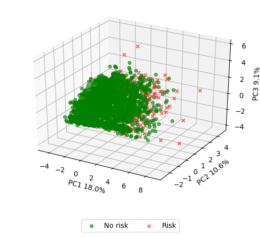
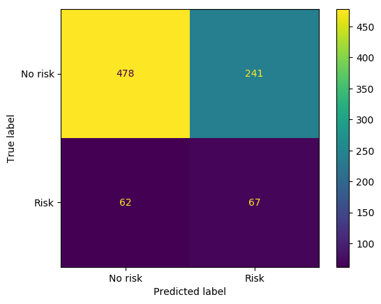
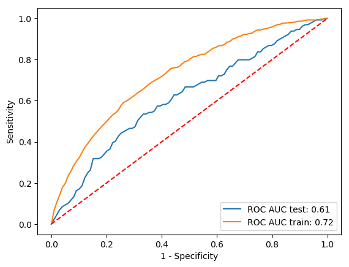
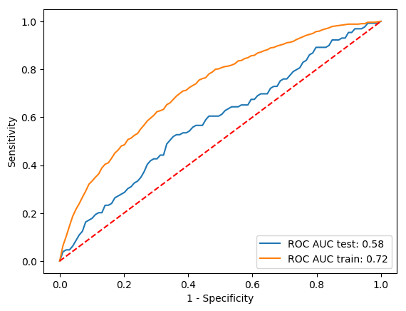

## Welcome to the CS 7641 Project

### Introduction

Machine learning (ML) is becoming a powerful tool in developing predictive models in human life and one of the primary fields in today's research is using this tool in finding risk factor and diagnosis of different types of diseases which may need tears of research to be investigated pathophysiologically. Among different types of diseases, Cardiovascular diseases (CVD) take a considerable portion of financial and heath tolls every year. So, our group decided to use ML in determining the chance of developing CVDs in people with different characteristics. In this project, we use a dataset from the revolutionary Framingham Heart Study to develop predictive models for CVD. Both supervised and unsupervised methods were used in this project.

### Background 
Cardiovascular diseases (CVD) are the number one cause of deaths worldwide, with over 17 million deaths per year [1]. Since 1947, the Framingham Heart Study (FHS) has been a central pioneer of the expansion from treatment-based to preventive medicine by establishing risk factor determination as a central pillar of data analysis of studying the disease. [2]. With more data available than ever before, machine learning has been shown to improve risk score predictions for CVD and beyond [3]. 
The dataset consists of continuous (i.e., Age, Cigarettes per day, etc.) and binary (Is this person a current smoker) variables. In total, there are 15 features included by over 4000 records. The aim is to predict if someone is at risk of developing a CVD within the next ten years and to pinpoint potential risk factors. The dataset is publicly available on [kaggle](https://www.kaggle.com/dileep070/heart-disease-prediction-using-logistic-regression).

### History of the Study 
|  |
|:--:| 
| *Logo of the Framingham Heart Study [13]* |

The Framingham Heart Study began in 1948, after President Franklin D. Roosevelt died of the widely mysterious cardiovascular disease. At this time, the medical community did not understand cardiovascular disease at all, and had no idea of any risk factors associated with the seemingly spontaneous death sentence. Even the extremely high blood pressure measurements that were taken from FDR were not seen to be indicative of any problem, because there was no association between high blood pressure and cardiovascular disease at the time. Truman signed the National Heart Act, which in part financially supported the study started by Gilcin Meadors in 1947, who collected the first subject for the study in 1948. Unlike most epidemiologiccal studies at the time, this study included men and women from Frammingham, Massachusetts evenly in the initial cohort. As time went on, the offspring of the initial cohort were also recruited to participate into the study. In 1961, study investigators from the Framingham heart study were the first to popular the terms "risk factor" and "risk score" as a novel analytical method to predict diasese, creating a logistic model with various factors, such as cholesterol, blood pressure, and number of cigarettes smoked. In 1988, they created what still is the best known risk profile for cardiovascular disease, the "Framingham Risk Score", and created the criteria still used today to define "heart failure". As time went on, they continued to better understand not only cardiovascular disease and the effectiveness of various treatment strategies, but also the risk factors associated with strokes. They have recruited the third generation children of the offspring cohort, and also now have added cohorts additional  to bring ethnic diversity to the study, which previously only analyzed white and European citizens of Framingham, Massachusetts. 

### Data Description
The data used in this study comes from a subset of the Framingham Heart Study participants. It has 15 features and 4000 subjects. A correlation matrix for the features of this dataset can be found below. It shows the relationship between the different features, many of which are predictable, such as prevelance of high glucose and diagnoses of diabetes being highly correlated. 

*Correlation Matrix*

The dataset has been split in to a training and test set in stratified fashion. 20% of the dataset have been designated for the test set. The preprocessing steps delineated below have been applied seperately, but with the same parameter setting, to the training and test set respectively. The model is trained in a 10fold stratified cross-validation on the training set and the performance is assessed on the test set. 

## Unsupervised Learning Section
### Data Cleaning
One of the most challenging tasks in data analysis is data cleaning, on which scientists spend an enormous amount of time enhancing the reliability and quality of the data. In working with any real dataset, usually, there are some data points in which some features are missing. This is usually due to not maintaining the data correctly or because this data has not been recorded initially. These missing values incur errors and unreliability in the analysis and eventually leads to not having a robust predictive model. To overcome this problem, we need to find and imput values for the missing ones by using the standard probabilistic models or even refine the data to remove the errors. This helps us to obtain a reliable dataset that improves the quality of the training data for analysis and provides accurate decision-making.

Similar to all experimental set of data, the data used in this project has some missing values for some features. The data used in the current project has 4240 labeled data points with 15 features, of which 6 features have some missing values. There are many ways in which data cleaning can be executed. Most commonly, one could remove the datapoints with any number of missing values. In this case we would lose a significant portion of the data, which could diminish the reliability of the model. More efficiently, one could find the average of values of a feature of the *k*-nearestest-neighbors within a class and use the average to impute the missing value. The optimal number for *k* has been determined using the elbow method. The plot below shows that *k=5* is a suitable choice as well as that the KNNImputer implemented in scikit-learn and our own implementation yield similar results. *k=5* has been identified to be the optimal choice during grid search as well.
In this project, although the differences between the calculated values are not very vast, imputing based on the labels was used.

   
*Elbow method kNN-Imputer*

### Feature engineering
After the data cleaning we generated polynomial and interaction features to increase the chance of unrevealing greater differences with respect to the class labels. However, the grid search described belowed, showed that this may lead to severe overfitting thus a degree of *1* used by default. 

### Dimensionality Reduction through Principle Component Analysis 

To make the data easier to work with, principle component analysis was done to reduce the number of dimensions of the dataset. After feature engineering, the dataset was very large, as combinations of variables were made. The PCA Scikit-Learn API was used, with the optimize functionality turned on within that function to choose what combination of features will be best.The grid search described later in the text yielded *n_components=10* to be the optimal number of components to keep. However, during the feature selection described in the next paragraph two of these PCs are removed. The recovered variance and the first three PCs are shown in the plot below.

### Feature selection
Since the feature space has been blown up by the feature engineering step mentioned above, we tried to reduce the dimensionality further by selecting only significant features. Therefore, the ANOVA F-value has been computed. The F-value is the ratio if two mean square values, the greater the F-value the more different the two groups are, meaning they have not been sampled from the same population. Based on the F-value it is possible to compute p-values based on which the final selection is made. All features with p-values greater than or equal to 0.05 are removed. The feature selection had manly a positive effect on the models performs. Generally, this procedure helps to tackle overfitting and hence leads to more general model. Additionally, it shortens the time required for training significantly.

*Projected PCA*
  
*Recovered variance*

## Supervised Learning Section

### Introduction
In working with any set of realistic data, we need to come up with a predictive model that can determine the outcome of new unseen data. This method is called classification, which can be executed by using the various mathematical technique. Among these techniques, Logistic Regression, Support Vector Machine, Random Forest, and Neural Network.

To better understand LR, it is helpful to have a good vision of linear regression. In linear regression, we look for a hyperplane which fits the data effectively. The main problem of using a linear regression model is that we are limited to continuous values and if a feature is binary will can not find a good fit for that. Here is the point where LR comes into play. The big difference between linear regression and logistic regression is the type of function. In linear one, the data follows a linear hyperplane in the general case, while in logistic regression, this function is S-shape coming from the exponential root and is called Sigmoid function. This function enables us to have a continuous mapping of the data and give any number between 0 and 1. As it turns out, we can translate our findings from the previous section into a function called Probability density function. To find the best fitting parameters of Sigmoid function, we can use maximum likelihood techniques to optimize the model according to the provided data.

   
*Logistic Regression [5]*

### Support Vector Machine Classifier

The support vector classifier is a classifier that aims to minimize the following function:

*Support Vector Machine optimization problem*

The classifier attempts to minimize the number of points misclassified by the classifier while also maximizing the “margin” or distance between the classes. The margin is defined by the points touching the “support” vectors on the edges of the margin. The general idea is that the support vectors should have a stronger impact on the placement of the class divider since they are closer to the margin, and that the margin should be as large as possible to ensure that the model is as generalizable as possible. 

*Support Vector Machine visualization [11]*

### Random Forest (RF)
The idea of RF has emanated from the decision tree technique. A decision tree is a simple and easy way to interpret data. But in practice, it is not excellent. The problem is that they work great with the data used to create them, but they are not flexible when it comes to classifying new samples. Here is where RF comes into the picture and combines the simplicity of decision trees with flexibility resulting in a vast improvement in accuracy. To implement FR, first, we need to create a bootstrap dataset. This means that we randomly select samples from the original dataset. The important thing is that we are allowed to select a datapoint multiple times. The next step is to create a decision tree using the bootstrapped dataset, but only use a random subset of features at each step. This step can be done many times, which will result in many decision trees, which is called RF. Then we need to determine how accurate our RF model is. To do that, we can isolate a subset of data and run them to the RF model, and according to the overall outcomes of the model, we can find the accuracy of the model. From now on, for any new datapoint, we can run it into the model and see what the label comes out. To have a better RF model with higher accuracy, we need to tweak the number of subset features in making the decision trees. Here is a schematic picture of an RF model. 

  
*Random Forest [12]*

### Neural Network

Neural networks are a computuational analog to the biological neural networks found in human brains, designed to form probability-related associations between inputs to solve problems of regression or classification. The network is initialized as a set of random associations or "weights" between layered neurons and the resulting output is computed during the forward propogation step. During the backward propogration step, the weights are optimized to minimize the loss function using optimization techniques like stochastic gradient descent or the ADAM optimizer. The model's hyperparameters, like the number of hidden neurons, which activation function was used and regularization strength, can be optimized on a validation set. 

   
*Neural Network*

In order to classify the 10 year risk of coronary heart disease CHD, a feed forward, two hidden layer network was created, as shown above. The size of the input layer is the number of features, in our case being 15 features we have 15 input neurons. Next, we choose the number of hidden layers to be two. Selecting two hidden layers for the network is best because if we choose more layers, we are more likely to run into overfitting issues due to the model being too complex to learn the underlying sturcture, similar to using a polynomial of degree 6 to learn a quadratic function. In addition, the vanishing gradient problem can occur in networks too deep due to multiplication of the paritial derivatives for each layer [5]. Selecting less than two hidden layers could result in the model not being able to learn non-linearly seprable data, as in the classic example of a single perceptron network not being able to learn the XOR function because there is no linear path between (0,0) and (1,1), as shown below [6]:

*XOR problem in single layer perceptrion(6)*

The activation function of choice for the hidden layers was the Relu function due to other classical functions like Sigmoid and Tanh tend to saturate the information, since they are mostly sensitive to changes around their midpoints [7]. For the backpropogation step, the stochastic gradient descent alogrithim was used with a learning rate of 0.0001. This learning rate was chosen by running the model with multiple rates and seeing which one provided fast convergence over the 150 epochs used to train. The dataset was split into 66% training and 33% test. In order to quantify perfomance, a binary cross entropy loss function was for training and testing. The following plots show the training loss vs epochs as well as accuracy vs epochs. 

*Model loss train and test vs epochs*

## Results

### Finding the best estimator
We evaluate the performance of logistic regression (LR), support vector machine (SVC), random forest (RF) and a neural network (NN) with respect to prediction of risk of developing a heart disease within ten years. 
The performances have been assed in terms of accuracy (ACC) and area under (AUC) the receiver operating characteristic (ROC) curve. These to metrics did not necessarily positively correlate with each other since the present dataset is highly skewed with respect to the class labels. The number of patients without risk of developing a heart disease is dramatically outweighing those who are in risk (~85% vs. 15%). Hence, the classifier would perform very well when always predicting *No risk* when using accuracy as a measure. However, this would cause a drop in true positive rate or sensitivity and thereby lead to a low AUC. Thus, the same classifier would perform badly in terms AUC.

In order to decide which of the above mentioned classifier works the best on our dataset, we performed a grid search over the following parameter space:
 - k the number of nearest neighbors within a class to consider when imputing the missing values
- d: the degree used for creating polynomial features
- n : the number of components to keep during the PCA
- method: the estimator (one of LR, SVC, RF, NN)
The performance of the classifier has been assessed in a stratified, 10fold cross-validation for each of the parameter configurations.
When assessing the performs with respect to the accuracy a random forest classifier outperforms the other classifier with an accuracy of *0.85* but the AUC is *0.47* and thereby, as good as flipping an unbiased coin. *k* has been found to be 2, *d* to be 3 and *n* to be 4. However, as shown below the scenario of high accuracy and low AUC described above occurs with these settings. The model just always predicts *No risk* which is a good guess just by chance but it misses nearly all patients who are at risk. Indeed, the model is predicted all samples with label *No risk*, for which reason it did not learn anythin. In a medical setting this is particularly bad when it is desired to catch as many people at risk as possible. Thus, AUC is the more appropriate metric to assess the classifiers performance.

*Confusion matrix RF optimized with respect to ACC*

*ROC curve RF optimized with respect to ACC*

When conducting the grid-search with respect to the AUC, SVC turns out to outperform all other classifiers. With *k=5*, *d=1* and *n=10* it achieves an AUC of *0.62* and accuracy of *0.64*. But as can be seen below the number of correctly predicted patients is higher albeit not greater either. However, the increased sensitivity comes with an decrease in terms specificity (compare number of FP predictions). The ROC curve suggests that the model started to overfit slightly indicated by the ROC curve on test being below the one for the training set. This explains why polynomial feature did not bolster the performance since they would add to the overfitting.

*Confusion matrix SVC*

*ROC curve SVC*

The performance of LR, RF and NN with the same parameters are shown below. Logistic Regression achieves an AUC of 61 and a ACC of 0.67.

*Confusion matrix LR*

*ROC curve LR*

The RF achieves an AUC of 0.56 and a ACC of 0.85 and the  NN yields an AUC of 0.58 and a ACC of 0.84. Both predict virtually all sample to be *No risk* indicating they did not learn anything meaningfull but just guess a label based on the skewed dataset.

*Confusion matrix RF* 

*ROC curve RF*

*Confusion matrix NN*

*ROC curve NN*
When the analysis is done without a PCA and without selecting the features based on p-values the AUC and ACC increase to *0.66*. However, the number true positive (TP) predictions is slight lower, 67 vs. 64 thus the improvement is achieved by a reduced number of FP, 241 vs. 225. If the PCA is performed without consecutive feature selection the model is overfitting, leading to an overall, worse performance.

*Confusion matrix SVC without PCA and feature selection*

While feature selection is performed but not PCA the AUC and ACC increase 0.67 and the TP increases to 69 (versus 67 with PCA and feature selection). At the same time the FP is lower, too, 223 versus 241.  As mentioned earlier, it is important to catch as many people at risk as possible thus we suggest to perform feature selection but not PCA since this setting yields the best sensitivity and specificity.

*Confusion matrix SVC without PCA but with feature selection*

*ROC curve SVC without PCA but with feature selection*

### Best features
As mentioned earlier, the best features are selected based on their p-values computed during an ANOVA and all features with p-values greater than or equal to 0.05 are removed. Among the 10 most significant features are *BMI*, *cigarettes per day* (implies being a *smoker*), *hyptertension* (implies *blood pressure medication*), *diabetes* (implies disturbances of the *blood glucose level*), *heart rate*, *diastolic blood pressure* and being *male*. All of these identified best features have been reported extensively in the literature and have been initially identified based on the data of the Framingham study.  

### Conclusions:
In conclusion, this project proves that it is possible to use machine learning to identify risk scores for a particular disease based on collection of features from subjects. The top 10 most significant features, mentioned above, are now for the most part common knowledge to those familiar at all with CVD. However, in the 1930s and 1940s, at the start of the Framingham Heart Study, this was not the case. Indeed, President FDR's blood pressure was measured to be 188/105 mm Hg, and he still was still deemed to be healthy by his personal physicians. It was not until the Framingham Heart Study started really diving into understanding the risk factors associated with CVD that the existence of these risk factors was brought to light. So while the usage of Machine Learning did not add additional findings beyond the traditional public health approach towards data analysis, the similarity between the machine learning based approach and the traditional approach supports the conclusion that machilne learning can be used for new diseases, not just CVD. There are many diseases that may be more complicated, and we have less datapoints or features, either in number or in quality  - and in these instances, the usage of machine learning approaches discussed in this paper could be extremely useful. As all of the members of this group are doing research in the biological or biomedical engineering fields, (is this true?????) we will undoubtedly take this knowledge with us as we apply similar approaches to our own work moving forward. 

### References:
[1] WHO fact sheet Cardiovascular diseases (CVDs), https://www.who.int/en/news-room/fact-sheets/detail/cardiovascular-diseases-(cvds)   
[2] Mahmood, S. S., Levy, D., Vasan, R. S., & Wang, T. J. (2014). The Framingham Heart Study and the epidemiology of cardiovascular disease: A historical perspective. In The Lancet (Vol. 383, Issue 9921, pp. 999–1008). Lancet Publishing Group. https://doi.org/10.1016/S0140-6736(13)61752-3.   
[3] Weng SF, Reps J, Kai J, Garibaldi JM, Qureshi N (2017) Can machine-learning improve cardiovascular risk prediction using routine clinical data?. PLOS ONE 12(4): e0174944. https://doi.org/10.1371/journal.pone.0174944.   
[4] Faris, H., Aljarah, I. & Mirjalili, S. Training feedforward neural networks using multi-verse optimizer for binary classification problems. Appl Intell 45, 322–332 (2016). https://doi.org/10.1007/s10489-016-0767-1.   
[5] Logistic Regression in R: A Classification Technique to Predict Credit Card Default. https://whatsthebigdata.com/2019/11/11/logistic-regression-in-r-a-classification-technique-to-predict-credit-card-default/     
[6] Rahman, Md Mahmudur, Bipin C. Desai, and Prabir Bhattacharya. "Medical image retrieval with probabilistic multi-class support vector machine classifiers and adaptive similarity fusion." Computerized Medical Imaging and Graphics 32.2 (2008): 95-108.
[7]Polat, Kemal, and Salih Güneş. "Breast cancer diagnosis using least square support vector machine." Digital signal processing 17.4 (2007): 694-701.
[8] S. Hochreiter, Y. Bengio, P. Frasconi, and J. Schmidhuber. Gradient flow in recurrent nets: the difficulty of learning long-term dependencies. In S. C. Kremer and J. F. Kolen, editors, A Field Guide to Dynamical Recurrent Neural Networks. IEEE Press, 2001.   
[9] Araújo, Lucas. “Solving XOR with a Single Perceptron.” Medium, Medium, 26 Mar. 2018, medium.com/@lucaspereira0612/solving-xor-with-a-single-perceptron-34539f395182.   
[10] Brownlee, Jason. “A Gentle Introduction to the Rectified Linear Unit (ReLU).” Machine Learning Mastery, 6 Aug. 2019, machinelearningmastery.com/rectified-linear-activation-function-for-deep-learning-neural-networks/.   
[11] https://www.saedsayad.com/images/SVM_2.png
[12] https://towardsdatascience.com/from-a-single-decision-tree-to-a-random-forest-b9523be65147
[13] www.heart.org/en/news/2018/10/10/framingham-the-study-and-the-town-that-changed-the-health-of-a-generation

### Dependencies

 - scikit-learn v0.23.1
 - pandas
 - numpy
 - joblib
 - matplotlib 
 - keras
 - tqdm

### How to run the pipeline
    ./pipeline.py
    Required parameters 
	    --data <path_to_data_file> csv file, column names in first line, last column contains class labels
	    --output_dir <path_to_output_directory>
    
    Optional parameters
	    -k <int> number of k-NearestNeighbor to consider while imputing values, default=5
	    --degree <int> max degree for creating polynomial features, default=1
	    --pca Perform PCA, default=False
	    --n_components <int> number of components to keep during PCA, default=10
	    --method [RF, LR, SVC, NN] supervised learning method to employ, default='SVC'
	    --categorical column names of categorical features, separated by a space, default=['education', 'male', 'currentSmoker', 'prevalentStroke', 'prevalentHyp', 'diabetes']
	    --threads <int> number of threads to use where parallelization is possible, default=8
	    --optimize run Grid search to find best parameters. Modify parameter space at top of script in perform_gridsearch()
	    --verbose verbosity
    
    Expected Output in --output_dir:
    - model.sav or model.h5 trained model
    - roc_curve.png Plot of ROC curve of evaluation during cross validation on training set
    - confusion_matrix.png Confusion matrix of prediction on test set
    - correlation_matrix.png Correlation matrix of raw feature after missing value imputation
    - if pca is performed:
      - pca_transformed.png Plot of datapoints in first 3 components
      - pca_recovered_variance.png Cumulative plot variance recovered with kept components
    - best_features.tab 10 best features:
      - if method == RF, 10 best feature based on Gini impurity in RF
      - else based on pvalues computed during ANOVA

